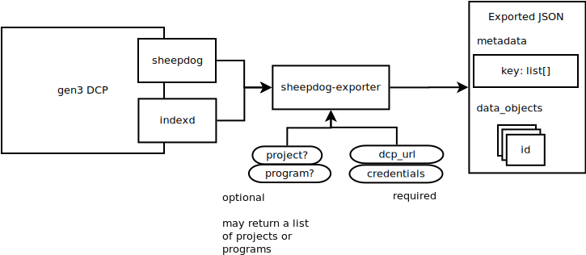

# sheepdog-exporter 🐑🐑
 

Export metadata from the DCP!



First, download your credentials from the <a href="https://dcp.bionimbus.org">DCP Web interface</a>.

Then, install sheepdog exporter: `pip install sheepdog-exporter`.

You can now find programs to export using: `sheepdog-exporter`!

Once you've found a program and project you want to export, use: `sheepdog-exporter my_program my_project`. This will create a JSON file in the current directory with all of the relevant metadata!

You can change the output path, path to your credentials, or the DCP URL using arguments:

```
sheepdog-exporter program project --dcp-url my-url --credentials path/to/credentials --output-path /path/to/write/output
```

The resulting JSON has the form:

```
{
  "data_objects": [{DataObject},...],
  "metadata": {
        metadata_type: [{metadata_value}], ...
  }
}
```

Metadata types that are expected to have files associated with them will
have an `object_id` that matches an `object_id` in the data object manifest.

## Development

* A simple test demonstrates usage of the Exporter class in `test`.

### Using the Python API

The exporter is available for reuse from your Python code, instantiate it
with the location of the credentials.json and the location of the DCP instance
you would like to export from:

```
from sheepdog_exporter import Exporter
exporter = Exporter('path/to/credentials', 'https://dcp.bionimbus.org')
my_export = exporter.export('topmed', 'public')
```

Other convenience methods are available for listing programs and projects: 
`.get_projects()` and `.get_programs()`.

See [sheepdog_exporter.py](sheepdog_exporter.py) for more.

## Issues

* Provenance to the original JSON schemas are lost. #9
  * It has not been tested if JSON dumps can be used as sheepdog input.
* Some functions in the exporter are unused.
* Print messages cannot be easily suppressed. #12
* Errors in converting data from DCP are not always relayed properly to the CLI. #11
